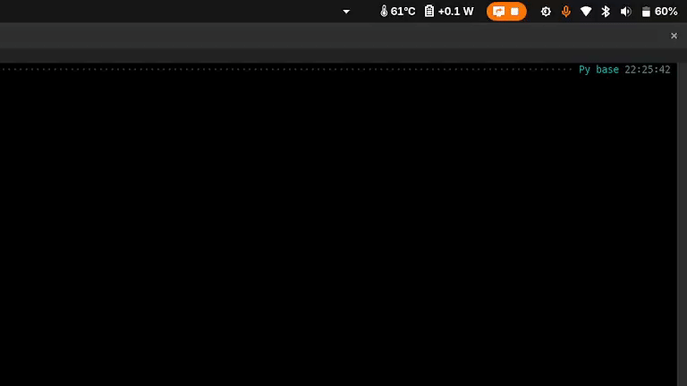

# Appstash

A collapsible system tray for GNOME. Stash top-bar indicators behind an arrow button and reveal them in a popup. Inspired by KDE Plasma System Tray.



## Purpose

In Gnome 2026 I could find not any extension that provides a System Tray to hide icons. An Gnome extension [Lilypad](https://github.com/shendrew/Lilypad) works, but fails to solve the issue of icons overlaying on top of the Gnome Clock.

## Status

**Proof of concept.** Written using generative AI tools as an experimental GNOME Shell extension.  Use it, fork it, learn from it. This is purely experimental I do not intend to support it in the future.

Targets GNOME Shell version:

- 50

## What it does

- Adds an arrow button to the top bar (`^` closed, `V` open).
- In preferences, pick which top-bar indicators to "stash".
- Stashed indicators are hidden from the panel; clicking the arrow reveals them in a popup row.
- A cog icon at the end of the popup opens preferences.
- Icon size, "hide when empty", and which indicators to stash are all configurable.

## Install

```sh
git clone https://github.com/ygurin/appstash.git
cd appstash
glib-compile-schemas schemas/
ln -s "$PWD" ~/.local/share/gnome-shell/extensions/appstash@ygurin.github.io
```

Then log out and log back in (Wayland requires this — there's no in-place reload). After login:

```sh
gnome-extensions enable appstash@ygurin.github.io
gnome-extensions prefs  appstash@ygurin.github.io
```

## Uninstall

```sh
gnome-extensions disable appstash@ygurin.github.io
rm ~/.local/share/gnome-shell/extensions/appstash@ygurin.github.io
```

## License

GPL-3.0-or-later.
